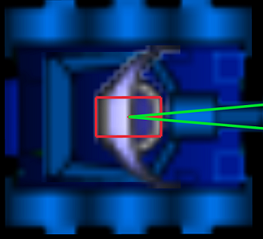

# ktanks

[](https://github.com/pellico/krobots/actions/workflows/rust.yml)

Ktanks is a game for software developers. 
Multiple tanks controlled are by software and fight until only one survive or after a configurable number of round (ticks). In the last case the one with less damages wins the game.
Tanks can move back and forward. Controlling software can turn tank, turret/cannon and radar.
At the center of simulated world there is power source that charges  tanks but if a tank is too far this tank looses energy proportionally with the distance from the power source.

## Features
* Tank software can be written in any language thanks to client-server architecture.
* Graphical UI for easier debugging.
* Server-client communication based on **UDP** packet

## Getting started

* Download and install following the instruction from [releases page](https://github.com/pellico/krobots/releases).
* Open a shell and run server: ```ktanks_server.exe 2```
* Open two other shell where run `dumb_robot.py <tank_name>` (in `examples.zip`) 

## Command line options to launch simulation server
```bash
USAGE:
    ktanks_server.exe [OPTIONS] <NUM_TANKS>

ARGS:
    <NUM_TANKS>    How many tanks in this game

OPTIONS:
    -h, --help                     Print help information
    -l, --log-level <LOG_LEVEL>    [default: info] [possible values: error, warn, info, debug,
                                   trace]
    -m, --max-steps <MAX_STEPS>    Max number of simulation step. If 0 no end until only one
                                   survived [default: 0]
    -p, --port <PORT>              Port used to register new tanks [default: 55230]
    -V, --version                  Print version information

```

After the launch server wait the connection of client until reaching the defined number of registered client.
To each client it is assigned the successive port starting from the one defined by `-p` option.

***
***Important*** Make sure that registration port and the successive until `registration port + NUM_TANKS` are available. In case server is executed behind a firewall or NAT open make sure to open the used port.
***

The simulation is terminated when only one tank survive or reached the number of steps specified by `--max-steps`. Simulation can be terminated any time using `Ctrl-q`. When simulation is terminated file named `simulation_output.csv` is saved in the current working directory with data of tanks.

## UI Controls of server
UI is mainly intended to support debugging of tank controlling software.

### UI controlling keys

* **Ctrl-q**: exit
* **q**: hide/show tank data 
* **o**: increase simulation speed
* **l**: decrease simulation speed
* **F1**: rendering stats
* **keypad 2,4,6,8**: move camera
* **PageUp / PageDown**: Select tank: Selected tank has uppercase name in tank list.
* **keypad 5**: reset to coordinates (0,0) or position of energy source
* **keypad 0**: to move camera to selected tank 


## Server graphics element description.

### Green triangle 
This represent radar detection area.

### Tank body and turret
The picture body is bigger than the actual body used by physical simulation. For this reason user can be surprised to see
a cannot bullet go through the body with damaging the body. Physical tank and turret body are visible by zooming greatly and they are displayed as red empty rectangles.
Tank physical body has 7.0 m length and 3.0 m width.




### Red Circle
Red circle represent the limit of tank power source. Beyond this limit the energy of the tank decrease linearly with the distance. If the tank is within the circle the tank energy is increased inversely with the distance from the center.

## Simulation
Presently the simulation is synchronized with refresh rate of graphic card/monitor. So the simulation real time speed depends on monitor and graphic card settings.
One `simulated sec` is 60 ticks or simulation step and for each graphic frame a simulation step is executed. So if monitor refresh rate is 30 frames/sec a `simulated sec` is equivalent to 2 real time sec.

### Angle 
Angle are always in radians in the range of ]-PI,PI]. 
```
              PI/2
                |            
                |
                |
                |
                |
                |
-PI -------------------------- PI
                |
                |
                |
                |
                |
              -PI/2

```

## Tank dynamics

Tank body can rotate, move forward and backward.
Developer can set the fraction [-1.0,1.0] of maximum power allowed to move forward (positive value) and backward (negative value). Also for rotating the tank developer can set a fraction of maximum allowed power to rotate counterclockwise (positive value) or clockwise (negative value). See server interface library for more details. 

Tank body has a mass so an inertia this means that setting power to 0.0 doesn't stop immediately the tank. 
Due to the fact user set power, acceleration decrease with speed for a fixed power settings.

## Cannon

Developer can set angle of cannon referred to the tank. Cannon doesn't move instantaneously. Position of cannon can be read by getting `TankStatus` data structure. The speed of edge of cannon is added to the bullet when firing; therefore cannon and tank speed affects the direction and speed of bullet.
Speed and max range of bullets can be read using `SimulationConfig` data structure. 

### Cannon Temperature.
Cannon has temperature properties (cannon temperature is stored in `TankStatus`). If cannon temperature is >320 degrees it can not fire. For each cannon file the temperature is increased by 100 degrees and it is decremented at each simulation step by 2 degrees. Minimum cannon temperature is 20 degrees.

## Energy

Tank consumes energy when:

* Radar operation
* Moving tank body
* Firing cannon

Tank is recharged at every simulation step by a quantity that is inversely proportional with the distance from 
the power source. Power source is at the center of game field and its distance and direction can be read by getting `TankStatus` data structure. When tank is beyond the `zero_power_limit` energy of tank is decreased proportionally with the distance from power source. `zero_power_limit` distance is stored in `SimulationConfig` structure.
**Note** Radar has priority in power consumption compared to the other operation.

## Damage

Tank is damaged when hit by a bullet. When damage is greater than  `damage_max`, tank is no longer able to move, fire or using radar.  `damage_max` is stored in `SimulationConfig` structure.

# Tank interface libraries
Presently only a python library is provided to communicate with server.

## Python library

[Python library and examples are available documentation](python/README.md) 


# Credits
Tank .png pictures are from [Robocode project](https://robocode.sourceforge.io/)
Tank icon [Tank icon](https://commons.wikimedia.org/wiki/File:Panzer_aus_Zusatzzeichen_1049-12.svg)


