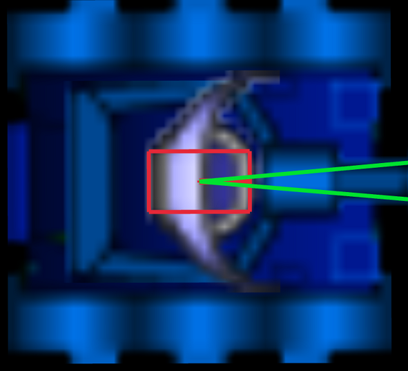

# krobots
Krobots is a game for software developers. 
Multiple tanks controlled by software fight until only one survive or after a configurable number of round (ticks). In the last case the one less damages win.
Tanks can move back and forward. It is possible to turn tank, turret/cannon and radar.
At the center of simulated world there is power source that charge the tanks but if the tank is too far the tanks loose energy proportionally with the distance from the power source.

## Features
* Tank software can be written in any language thanks to client-server architecture.
* Graphical UI for easier debugging.
* Server-client communication based on UDP packet

## Command line options
```bash
USAGE:
    krobots.exe [OPTIONS] <NUM_TANKS>

ARGS:
    <NUM_TANKS>    How many tanks in this game

OPTIONS:
    -h, --help                     Print help information
    -l, --log-level <LOG_LEVEL>    [default: info] [possible values: error, warn, info, debug,
                                   trace]
    -m, --max-steps <MAX_STEPS>    Max number of simulation step. If 0 no end until only one
                                   survived [default: 0]
    -p, --port <PORT>              Port used to register new tanks [default: 55230]
    -V, --version                  Print version information

```

After the launch server wait the connection of client until reaching the defined number of registered client.
To each client it is assigned the successive port starting from the one defined by `-p` option.
***
***Important*** Make sure that registration port and the successive until `registration port + NUM_TANKS` are available.In case server is executed behind a firewall or NAT open make sure to open the used port.
***

## UI Controls of server
* **Ctrl-q**: exit
* **q**: hide/show tank data 
* **F1**: rendering stats

### Control Camera
* **keypad 2,4,6,8**: move camera
* **keypad 5**: reset to coordinates (0,0) or position of energy source
* **keypad 0**: to move camera to selected tank 
* **PageUp / PageDown**: Select tank: Selected tank has uppercase name in tank list.

## Server graphics element description.

### Green triangle 
This represent radar detection area.

### Tank body and turret
The picture body is bigger than the actual body used by physical simulation. For this reason user can be surprised to see
a cannot bullet go through the body with damaging the body. Physical tank and turret body are visible by zooming greatly and they are displayed as red empty rectangles.




### Red Circle
Red circle represent the limit of tank power source. Beyond this limit the energy of the tank decrease linearly with the distance. If the tank is within the circle the tank energy is increased inversely with the distance from the center.

## Simulation
Presently the simulation is synchronized with refresh rate of graphic card/monitor. So the simulation real time speed depends on monitor and graphic card settings.
One `simulated sec` is 60 ticks or simulation step and for each graphic frame a simulation step is executed. So if monitor refresh rate is 30 frames/sec a `simulated sec` is equivalent to 2 real time sec.

### Angle 
Angle are always in radians in the range of ]-PI,PI]. 
```
              PI/2
                |            
                |
                |
                |
                |
                |
-PI -------------------------- PI
                |
                |
                |
                |
                |
              -PI/2

```

## Tank dynamics

Tank body can rotate, move forward and backward.
Developer can set the fraction [-1.0,1.0] of maximum power allowed to move forward (positive value) and backward (negative value). Also for rotating the tank developer can set a fraction of maximum allowed power to rotate counterclockwise (positive value) or clockwise (negative value). See server interface library for more details. 

Tank body has a mass so an inertia this means that setting power to 0.0 doesn't stop immediately the tank. 
Due to the fact user set power, acceleration decrease with speed for a fixed power settings.

## Cannon

Developer can set angle of cannon referred to the tank. Cannon doesn't move instantaneously. The speed of edge of cannon is added to the bullet when firing. Therefore cannon and tank speed affects the direction and speed of bullet.
Speed and max range of bullets can be read using server interface. 


# Tank interface library
Presently only a python library is provided to communicate with server.

## Python library

[Python package Documentation](https://pellico.github.io/krobots/)

Developer can find simple tank example in the example folder


